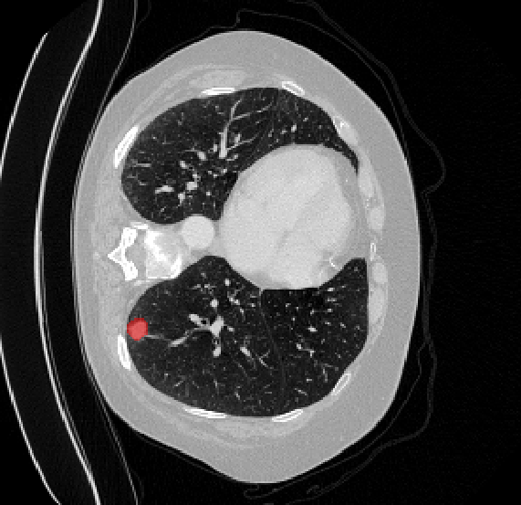

# 🫁 Lung Tumor Segmentation 3D (CT · MONAI)

> Segmentation of **lung tumors on 3D CT scans** (Medical Segmentation Decathlon — Task06_Lung)
> with a **MONAI** pipeline, plus a **web demo** to scroll through slices with a tumor overlay and
> **quantify tumor volume (ml)**. All training & evaluation run on a **single local RTX 4060 8GB GPU**.

<p>


</p>

---

## 🎬 Demo

Upload a CT volume (`.nii.gz`) → the model segments the tumor, renders a red overlay on each axial
slice (scroll with the slider), and reports the estimated **tumor volume**.



> *(Above: a CT slice with the model-predicted tumor in red, plus a badge showing tumor volume computed as voxel count × voxel size.)*

Run the demo locally:

```bash
uvicorn api.main:app --reload --port 7860       # open http://127.0.0.1:7860
```

---

## 📊 Results

Evaluated on a **held-out test set of 9 cases** the model **never saw during training** (fixed split, `seed=42`):

| Model | Params | Test Dice ↑ | Test HD95 (mm) ↓ | Speed (s/vol) ↓ |
|---|:---:|:---:|:---:|:---:|
| **UNet 3D (MONAI)** | 4.81M | **0.364** | 56.7 | 0.45 |
| *nnU-Net — SOTA reference* | ~30M | *~0.65–0.74* | — | — |

**Reading the numbers honestly:**
- A Dice of **0.36** is modest versus SOTA, but reasonable for a **lightweight UNet (4.8M params)** trained
  on only **45 cases** under an **8GB VRAM** budget. This is not a cherry-picked figure — it is the real
  score on a locked-away test set.
- **Validation ↔ test gap:** validation-best reached ~**0.62** while the test score is **0.36**. The gap comes
  from (a) validation-best being optimistically biased and (b) the 9-case test set being noisy.
  **The held-out test number is the one to trust.**
- HD95 ~57mm reflects sizable boundary errors on hard cases (small / multifocal tumors).

*(The `params` and `s/vol` columns support an **accuracy-vs-deployability** argument — see `results/benchmark.csv`.)*

---

## 🎯 Problem & motivation

Lung cancer is among the most common and deadliest cancers. Segmenting the tumor on CT is the basis for
**volume measurement, progression tracking, and treatment planning** — but doing it by hand is slow and
expensive in clinician time. The goal here: **automatically segment lung tumors on 3D CT** and **quantify
their volume**, packaged as a usable web demo.

This project upgrades a **2D** U-Net baseline (PNG images, tutorial-level) into a real **3D medical-imaging
pipeline**: actual CT data in NIfTI format, Hounsfield-unit preprocessing, a 3D model, multi-metric
evaluation on a locked test set, and a visual demo.

---

## 🗂️ Data

- **Source:** [Medical Segmentation Decathlon](http://medicaldecathlon.com/) — **Task06_Lung** (chest CT, tumor labels).
- **Size:** 63 labeled cases (NIfTI `.nii.gz`), downloaded automatically via MONAI `DecathlonDataset`.
- **Fixed 3-way split by seed** (`ml/data/datamodule.py`):

  | Split | Cases | Role |
  |---|:---:|---|
  | train | 45 | learning |
  | val | 9 | early stopping, best-checkpoint selection |
  | **test** | **9** | **locked away, final report only** |

  The same `seed` makes training and evaluation produce the **exact same split** → the test set is genuinely unseen.

---

## 🔬 Method

**Preprocessing (MONAI 3D transforms — `ml/data/transforms.py`):**
- Reorient to canonical `RAS`, **resample** to a uniform spacing of `1.5 × 1.5 × 2.0 mm`.
- **HU windowing** with a lung window `[-1000, 400]` → normalized to `[0, 1]`.
- `CropForeground` drops empty background; during training, sample **96³ patches** with balanced pos/neg
  (`RandCropByPosNegLabel`) so small tumors aren't drowned out by background.
- **Light** augmentation (flip, rotate90, shift-intensity). Strong augmentation is **optional** (off by default — see below).

**Model (`ml/models/factory.py`):**
- **UNet 3D (MONAI)** — channels `(16, 32, 64, 128, 256)`, 2 residual units, **4.81M params**.
  Two output classes: background / tumor.
- **SwinUNETR** is also wired up (transformer encoder, gradient checkpointing enabled for the 8GB GPU) for comparison.

**Training (`ml/training/train3d.py`):**
- **Loss = DiceFocalLoss** (reasoning in the "Engineering story" section).
- AdamW `lr=1e-4`, **mixed precision (AMP)**, validation via **sliding-window inference** (roi 96³, overlap 0.5).
- **Gated early stopping** `early_stop_min_dice=0.05`: patience only starts counting **after** the model
  escapes the collapse phase — avoiding a premature stop.

**Evaluation (`ml/training/metrics3d.py`, `evaluate3d.py`):**
- Per-class **Dice** and **Hausdorff95 (HD95)**, `include_background=False` (drop the background class, ~99% of
  voxels, so Dice isn't inflated). Results are appended as one row to `results/benchmark.csv`.

---

## 🧠 Engineering story (what was actually hard)

> The "engineer's narrative" — decisions and lessons, not just numbers.

1. **Foreground collapse.** The tumor occupies only **~0.1% of voxels**. With the default `DiceCELoss`, the model
   quickly learns the shortcut of "**predict all background**": loss drops nicely but **Dice → 0**. Switching to
   **DiceFocalLoss** (Focal heavily penalizes the rare class) finally made it learn the tumor. `TverskyLoss` is kept as a fallback.

2. **"Collapse-then-recover".** Dice stays around **0 for the first ~38–40 epochs**, then suddenly **takes off**
   (validation climbed to ~0.62). Lesson: **be patient** — don't stop in the Dice≈0 "valley". That's exactly why
   the `early_stop_min_dice` gate exists.

3. **Complexity ≠ better (on small data).** Trying **strong augmentation** (noise/smooth/gamma) and a **cosine LR
   scheduler** both made the collapse **deeper and harder to escape** on 45 cases. → Both were demoted to **optional,
   off by default**. The "less fancy" choice won.

4. **Windows + CacheDataset.** `DataLoader(num_workers>0)` duplicates the cache → RAM blow-up. → set
   `loader_workers=0` (workers are only used for the initial caching step).

5. **Accuracy vs deployability — a measured trade-off.** I tried **SwinUNETR (62M params, ~13× the UNet)**.
   On the RTX 4060 8GB it **saturated VRAM (~7.9 / 8.2 GB)** and took **~26 min/epoch** even with gradient
   checkpointing — training it to convergence would take roughly a full day, impractical on this hardware.
   The lightweight UNet (4.8M params, 0.45 s/vol, comfortable VRAM headroom) was the pragmatic pick.
   Knowing **when *not* to reach for the heavier model** is itself the production mindset.

---

## ⚡ Deployment & inference latency

The trained UNet is exported to **ONNX** (`python -m ml.deploy.onnx_export`) and verified: the ONNX
model reproduces the PyTorch segmentation **exactly (100% voxel-label agreement)**. Latency per
96³ patch (mean of 30 runs, RTX 4060 8GB):

| Backend | ms / patch | |
|---|:---:|---|
| **PyTorch (CUDA)** | **~7** | ~18× faster than CPU |
| PyTorch (CPU) | ~130 | |
| ONNX Runtime (CPU) | ~133 | ≈ PyTorch CPU — no free CPU speedup |

**Honest takeaways:**
- This 3D model **strongly prefers a GPU** (~18×). On CPU a full volume (sliding-window) would be
  ~18× the 0.45 s/vol → a few seconds — still fine for a non-realtime clinical tool.
- ONNX Runtime gave **no CPU speedup** here (PyTorch CPU already uses optimized MKL kernels). The
  value of the ONNX export is **portability** (run without a PyTorch/CUDA install) and a **path to
  TensorRT** for real GPU acceleration — left as future work.

---

## ⚠️ Limitations 

- **Small dataset:** 45 training cases and **a single 9-case test measurement** → a **noisy** number. K-fold
  cross-validation would be more robust (on the roadmap).
- **Val (0.62) ↔ test (0.36) gap:** noted in Results — reported on **test** to avoid sugar-coating.
- **8GB VRAM constraint:** limits batch size, patch size, and architecture choices.
- **The demo is not production:** state is kept in RAM and serves **one user** at a time.

---

## 🚀 Setup & run

> Verified on **Python 3.13 + CUDA 12.6**. The GPU build of PyTorch must be installed **separately**
> (don't let requirements pull the CPU build).

```bash
# 1) PyTorch with CUDA (install first, separately)
pip install torch==2.8.0 torchvision==0.23.0 --index-url https://download.pytorch.org/whl/cu126

# 2a) Demo / inference only:
pip install -r requirements.txt
# 2b) OR full training + evaluation:
pip install -r requirements.train.txt

# 3) Sanity-check the environment (expected: 2.8.0+cu126 True 1.5.2 2.4.6)
python -c "import torch, monai, numpy; print(torch.__version__, torch.cuda.is_available(), monai.__version__, numpy.__version__)"
```

**Main commands:**

```bash
python -m ml.data.download        # download MSD Task06_Lung (~9GB, once)
python -m ml.data.check           # sanity-check the pipeline -> results/sanity_check.png
python -m ml.training.train3d     # train (UNet 3D, default config)
python -m ml.training.evaluate3d  # evaluate on test -> results/benchmark.csv
uvicorn api.main:app --port 7860  # web demo -> http://127.0.0.1:7860

# Compare against a heavier architecture (8GB needs batch 1):
python -m ml.training.train3d --model swin_unetr --batch-size 1
python -m ml.training.evaluate3d --model swin_unetr
```

**Or run the demo with one command (Docker):**

```bash
docker compose up --build        # builds the image + serves on http://localhost:7860
```

The compose file mounts `./checkpoints` into the container (so the model isn't baked into the
image) and runs **CPU inference** — portable, no CUDA needed. Requires a trained
`checkpoints/best_monai_unet.pth`.

> All hyperparameters live in `ml/config/default.yaml` (loss, spacing, HU window, roi_size, early stopping…).

---

## 📁 Project structure

```
ml/
  config/default.yaml      # ALL hyperparameters (dot-access via load_config)
  data/                    # download · 3D transforms · datamodule (split) · sanity-check
  models/factory.py        # build_model: monai_unet | swin_unetr (+ count_parameters)
  training/
    train3d.py             # main training loop (DiceFocalLoss + AMP + sliding-window + early stop)
    evaluate3d.py          # test evaluation -> benchmark.csv
    metrics3d.py           # SegMetrics: per-class Dice + HD95
api/
  inference.py             # LungTumorInference: load model + preprocess + sliding-window + tumor volume
  main.py                  # FastAPI: /predict (.nii.gz) · /slice/{z} (PNG overlay)
web/                       # viewer: upload + slice slider + overlay + volume badge
docker/                    # Dockerfile.app · Dockerfile.train
requirements.txt           # inference   ·   requirements.train.txt  # + training
```

---

## 🛣️ Roadmap

- [x] **ONNX export** + latency benchmark (PyTorch vs ONNX Runtime).
- [x] **pytest** suite (GPU-free unit tests).
- [ ] **K-fold cross-validation** → a robust number (e.g. `0.42 ± 0.05`) instead of one 9-case measurement.
- [ ] **MLOps:** docker-compose · GitHub Actions CI · TensorRT (real GPU speedup).
- [ ] **Deploy** the demo online (Hugging Face Space).

---

<sub>Data: Medical Segmentation Decathlon (Task06_Lung). Educational / portfolio project — not for clinical diagnostic use.</sub>
